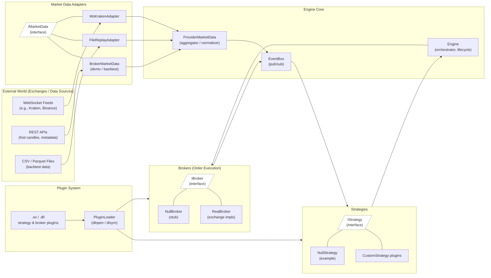

# Trading Engine Architecture

This document describes the high-level system design, component responsibilities, and event flow.

## System Overview



## Component Responsibilities

### Market Data Adapters (`include/adapters/`)

**Purpose**: Ingest external market data sources and normalize them.

**Responsibilities**:
- Connect to external data sources (exchanges, files, APIs)
- Parse and normalize raw messages
- Emit standardized events: `Tick`, `Quote`, `TradePrint`, `Candle`
- **Never** send orders, track balances, or know account state

**Examples**: `BrokerMarketData`, `WsKrakenAdapter`, `FileReplayAdapter`

**Write-only**: Data flows IN to the system only. Never out.

### Provider Market Data (`engine/ProviderMarketData`)

**Purpose**: Aggregator & normalizer for multiple market data feeds.

**Responsibilities**:
- Attach multiple adapters
- Subscribe to ticks from each adapter
- Normalize and publish unified events to EventBus
- Handle feed lifecycle (start/stop)

### Engine Core (`engine/Engine`)

**Purpose**: Orchestrator and lifecycle manager.

**Responsibilities**:
- Hold references to strategy, broker, market data
- Subscribe to `ProviderTick` events from bus
- Forward ticks to strategy
- Poll strategy for trade decisions
- Execute orders through broker
- Manage shutdown lifecycle

### Strategies (`include/strategies/`)

**Purpose**: Trading logic and decision making.

**Responsibilities**:
- Receive market ticks via `on_price_tick()`
- Analyze price data and compute signals
- Maintain internal state (SMA, indicators, position tracking)
- Return trade decisions via `get_trade_action()`
- Receive order fills via `on_order_fill()`

**Decoupled from infrastructure**: Strategies are "dumb" to symbols, exchanges, or broker details. A single strategy works with any symbol/broker combo.

### Brokers (`include/engine/IBroker`)

**Purpose**: Order execution and account management.

**Responsibilities**:
- Accept orders from engine
- Execute limit/market orders
- Manage account state (balance, positions, margin)
- Emit order lifecycle events: `OrderPlaced`, `OrderFilled`, `OrderRejected`
- Publish events back to EventBus
- Track open order statuses and IDs

### EventBus (`engine/EventBus`)

**Purpose**: Central publish-subscribe hub for all system events.

**Design**:
- `publish(Event ev)` → broadcasts to all subscribers
- `subscribe(topic, handler)` → receives events matching topic
- Decouples producers from consumers
- Type-safe via `std::any` with `std::any_cast`

**Topics**:
- `ProviderTick` — market data
- `OrderPlaced` — order entered system
- `OrderFilled` — order executed
- `OrderRejected` — order validation failed
- Future: `PositionUpdated`, `AccountUpdated`, etc.

## Order Lifecycle & Event Flow

### Order State Machine

```
NEW (strategy decides to trade)
  ↓
  Engine calls broker.place_limit_order(order, price)
  ↓
WORKING (broker received, queued for execution)
  ↓ (execution succeeds)
FILLED / PARTIALLY_FILLED (confirmed execution, position updated)
  ↓ (execution fails or rejected)
REJECTED (broker validation failed: insufficient balance, etc.)
```

### Event Flow: Strategy → Broker → Frontend

```
┌─────────────────────────────────────────────────────────────────────┐
│                         TRADING ENGINE FLOW                         │
└─────────────────────────────────────────────────────────────────────┘

Strategy Decision (tick arrives, analysis complete)
       ↓
Engine polls strategy.get_trade_action()
       ↓
Engine calls broker.place_limit_order(order, price)
       ↓
┌──────────────────────────────────────────────────────────────────┐
│ BROKER: Assign order ID, set status=WORKING                     │
│ Publish → EventBus: OrderPlaced {id, symbol, qty, side}        │
└──────────────────────────────────────────────────────────────────┘
       ↓
┌──────────────────────────────────────────────────────────────────┐
│ BROKER: Check execution logic (limit price vs market)           │
│                                                                  │
│ If executable:                                                   │
│   → Update broker state (balance, positions)                    │
│   → Set status=FILLED, record filledQty & fillPrice            │
│   → Publish → EventBus: OrderFilled {id, filledQty, price}     │
│                                                                  │
│ If validation fails (e.g., no position to sell):               │
│   → Set status=REJECTED, record reason                          │
│   → Publish → EventBus: OrderRejected {id, reason}             │
└──────────────────────────────────────────────────────────────────┘
       ↓
┌──────────────────────────────────────────────────────────────────┐
│ FRONTEND BRIDGE: Subscriber to EventBus topics                  │
│                                                                  │
│ Receives OrderPlaced / OrderFilled / OrderRejected events       │
│ → Converts Order struct to JSON                                 │
│ → Broadcasts to all WebSocket clients                           │
└──────────────────────────────────────────────────────────────────┘
       ↓
┌──────────────────────────────────────────────────────────────────┐
│ FRONTEND: useEngineConnection hook receives WebSocket message   │
│                                                                  │
│ Parses JSON by message.type:                                    │
│   • OrderPlaced   → addOrder() to store, status=WORKING         │
│   • OrderFilled   → updateOrderStatus() + updatePosition()      │
│   • OrderRejected → rejectOrder() with reason                   │
│   • ProviderTick  → addTick() for chart                         │
└──────────────────────────────────────────────────────────────────┘
       ↓
Zustand stores updated (orders, positions, ticks)
       ↓
React components subscribe to stores, re-render
       ↓
UI displays: Orders Panel, Positions Panel, Chart indicators
```

### Event Topics Table

| Topic | Publisher | Subscribers | Payload |
|-------|-----------|-------------|---------|
| **ProviderTick** | ProviderMarketData | Strategy, FrontendBridge | `Tick {symbol, last, ts}` |
| **OrderPlaced** | Broker | FrontendBridge | `Order {id, symbol, qty, status=WORKING, ...}` |
| **OrderFilled** | Broker | FrontendBridge, Strategy | `Order {id, filledQty, fillPrice, status=FILLED, ...}` |
| **OrderRejected** | Broker | FrontendBridge | `Order {id, rejectionReason, status=REJECTED, ...}` |
| **PositionUpdated** | Broker (future) | FrontendBridge | `{symbol, qty, avgPrice, timestamp}` |

## Key Design Principles

### 1. EventBus as Central Hub
All state changes flow through the EventBus. This decouples components:
- Strategies don't know about brokers
- Brokers don't know about frontends
- Frontend doesn't need to poll (all changes are pushed)

### 2. Order ID Assignment
Broker assigns unique `order.id` when order enters system. This enables:
- Tracking across entire lifecycle
- Matching fills to original orders
- Audit trails and order history

### 3. Immediate OrderPlaced Event
Published before execution check, giving:
- Frontend real-time visibility of all order attempts
- Strategy awareness of order submission
- No race conditions between decision and execution

### 4. Position Tracking
Frontend automatically updates positions with:
- Quantity deltas from fills
- Weighted average cost basis (updated on each fill)
- Real-time P&L calculations

### 5. Event-Driven, Not Polling
All state changes are published immediately:
- Sub-millisecond frontend updates
- No polling latency
- Clean separation between engine and UI

## Plugin System

Strategies and brokers are loaded as `.so` (Linux) / `.dll` (Windows) shared libraries:

```cpp
// Plugin factory function (discovered at runtime)
extern "C" {
    eng::IStrategy* create_strategy() {
        return new strategy::MovingAverageStrategy(...);
    }
}
```

Benefits:
- Hot-reload capabilities (reload strategy without rebuilding engine)
- Community plugins without modifying core
- Version compatibility via interfaces

See [strategies/README.md](strategies/README.md) and [include/brokers/README.md](include/brokers/README.md) for details.

## Data Flow Summary

```
External Data Sources
    ↓
Market Data Adapters (IMarketData)
    ↓
ProviderMarketData (aggregator)
    ↓
EventBus (pub/sub hub)
    ↓
Strategies (subscribers)
    ↓
Engine (orchestrator)
    ↓
Brokers (publishers of order events)
    ↓
EventBus (pub/sub hub)
    ↓
FrontendBridge (web relay)
    ↓
Frontend UI (React + WebSocket)
```

## Configuration & Extensibility

Future enhancements:
- **Strategy parameters**: Load from JSON/TOML config files
- **Broker configurations**: API keys, sandbox mode, etc.
- **Risk controls**: Position limits, stop-losses, circuit breakers
- **Multi-strategy**: Run multiple strategies on same data source
- **Backtesting**: Replay historical data through current architecture
