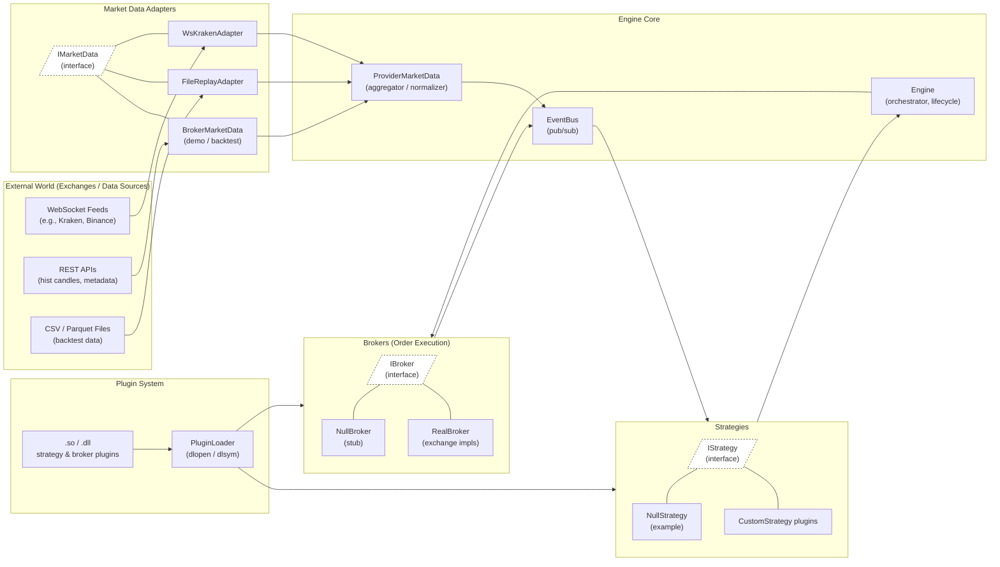

# trading-engine
stock bot try 2

# Folder Structure
- **trading-engine/**
  - `CMakeLists.txt`
  - **cmake/** _(optional custom CMake modules)_
    - `FindBroker.cmake`
  - **configs/**
    - **strategies/** _(per‑strategy config, e.g. JSON/TOML)_
    - **brokers/** _(per‑broker config)_
  - **include/** _(public headers)_
    - **engine/**
      - `EventBus.hpp`
      - `IStrategy.hpp`
      - `IBroker.hpp`
    - **plugins/**
      - `PluginLoader.hpp`
  - **src/**
    - **engine/** _(main engine implementation)_
      - `EventBus.cpp`
      - `Engine.cpp`
    - **plugins/** _(plugin‑loading glue)_
      - `PluginLoader.cpp`
    - **support/** _(REST/WebSocket, JSON, logging, etc.)_
      - `HttpClient.cpp`
      - `WebSocketClient.cpp`
  - **strategies/** _(compiled strategy plugins, .so/.dll)_
    - **MovingAverage/** _(example plugin)_
      - `CMakeLists.txt`
      - `MovingAverage.cpp`
      - `MovingAverage.hpp`
  - **brokers/** _(compiled broker plugins)_
    - **Binance/** _(example plugin)_
      - `CMakeLists.txt`
      - `BinanceBroker.cpp`
      - `BinanceBroker.hpp`
  - **tests/** _(unit & integration tests)_
    - `EngineTests.cpp`
    - `PluginLoaderTests.cpp`

# required packages
```
sudo apt-get update
sudo apt-get install -y \
    build-essential        \  # g++, make, etc.
    cmake                  \  # CMake + ctest
    ninja-build            \  # optional faster builds
    libboost-all-dev       \  # Boost libraries (Asio, filesystem, etc.)
    nlohmann-json3-dev     \  # JSON parsing
    libspdlog-dev          \  # Logging
    libcurl4-openssl-dev   \  # REST client (cURL)
    libwebsocketpp-dev     \  # WebSocket++
    libssl-dev             \  # TLS support
    pkg-config             \  # helps CMake find libs
    clang                  \  # if you wanna try Clang
    clang-format           \  # for code linting
    gdb                    \  # debugger
    valgrind               \  # memory checking
```

```
sudo apt-get update && apt-get install -y build-essential cmake ninja-build libboost-all-dev libspdlog-dev nlohmann-json-dev libcurl4-openssl-dev libwebsocketpp-dev libssl-dev pkg-config
```

# To build the project:
```
# from your project root
mkdir -p build && cd build

# configure
cmake .. -DCMAKE_BUILD_TYPE=Release

# build everything (engine libs, pluginloader, support, and any in-tree plugins)
cmake --build .

# (optional) run tests
ctest --output-on-failure

```


High-level ASCII representation


